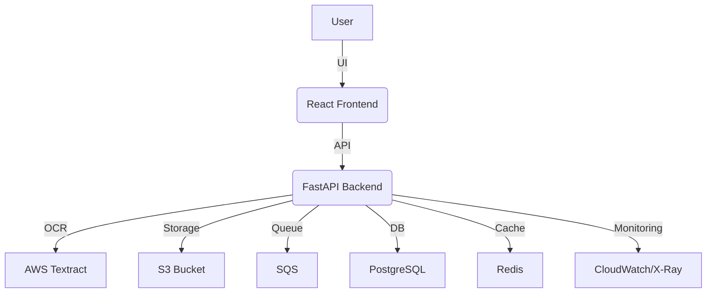

# AL-OCR-Project
Sophisticated Fintech OCR System for financial document intelligence, built with FastAPI, React, and AWS (S3/Textract). Features automated infrastructure via Terraform and CI/CD.

## Testing & Local Development

This repository includes an automated script to create a reproducible Python 3.11 test environment and run the test-suite.

### Quick Start
1. Ensure Python 3.11 is available on your PATH.
2. Run the helper script:
   ```bash
   ./tools/setup_test_env.sh
   ```

The script will create a `.venv`, install dependencies, and run the tests.

### Fallback (Docker)
If Python 3.11 is not available locally, the script automatically falls back to running tests inside a Docker container.


### Architecture Diagram



### Local Development with Docker Compose

For a fully containerized development environment including a simulated AWS environment (LocalStack):

1. Ensure Docker and Docker Compose are installed.
2. Run:
   ```bash
   docker-compose up
   ```
3. The frontend will be available at `http://localhost:5173` and the backend at `http://localhost:8000`.

### Development Standards

- **Pre-commit Hooks**: We use `pre-commit` to ensure code quality. Install it via `pip install pre-commit && pre-commit install`.
- **Contributing**: Please see [CONTRIBUTING.md](CONTRIBUTING.md) for details on our development process.
- **License**: This project is licensed under the [MIT License](LICENSE).

### Continuous Integration
GitHub Actions workflows are configured to run tests on multiple Python versions (3.9, 3.10, 3.11) on each push/PR to `main`.
