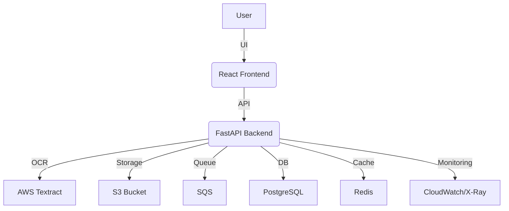

# AL-OCR-Project
[](https://github.com/Arisofia/AL-OCR-Project/actions/workflows/frontend-deploy.yml)
[](https://github.com/Arisofia/AL-OCR-Project/actions/workflows/deploy.yml)

Sophisticated Fintech OCR System for financial document intelligence, built with FastAPI, React, and AWS (S3/Textract). Features automated infrastructure via Terraform and CI/CD.

## Testing & Local Development

### Quick Start
1. Ensure Python 3.11 is available on your PATH.
2. Create and activate a virtual environment, then install dependencies:
   ```bash
   python3 -m venv .venv
   source .venv/bin/activate
   pip install -U pip
   pip install -r requirements.txt
   pip install -e ./ocr_reconstruct
   pytest
   ```

### Full Repository Validation
Run the production validation entrypoint to verify backend and frontend checks:

```bash
npm run validate:repo
```

CI/CD and deploy preflight checks can also be run directly:

```bash
npm run verify:cicd
npm run check:deploy-secrets
```

### Run Frontend + Backend Together

Use the unified local scripts:

```bash
npm run dev:up
```

This starts:
- Backend on `http://127.0.0.1:8000`
- Frontend on `http://127.0.0.1:5173`
- Redis on `127.0.0.1:6379` (auto-started via Docker only when not already running)

The script reads `OCR_API_KEY` from your environment or root `.env` and injects it into both services so OCR calls from the frontend work locally.

To stop both services:

```bash
npm run dev:down
```

Optional:
- Disable Redis auto-start: `REDIS_AUTOSTART=false npm run dev:up`


### Architecture Diagram


```mermaid
graph TD
   A[User] -->|UI| B(React Frontend)
   B -->|API| C(FastAPI Backend)
   C -->|OCR| D[AWS Textract]
   C -->|Storage| E[S3 Bucket]
   C -->|Queue| F[SQS]
   C -->|DB| G[PostgreSQL]
   C -->|Cache| H[Redis]
   C -->|Monitoring| I[CloudWatch/X-Ray]
```

### Local Development with Docker Compose

For a fully containerized development environment:

1. Ensure Docker and Docker Compose are installed.
2. Run:
   ```bash
   docker-compose up
   ```
3. The frontend will be available at `http://localhost:5173` and the backend at `http://localhost:8000`.

### Development Standards

- **Unified Toolchain**: We use [Ruff](https://github.com/astral-sh/ruff) for linting and formatting, [MyPy](https://mypy-lang.org/) for type checking, and [Pytest](https://pytest.org/) for testing. Configuration is centralized in `pyproject.toml`.
- **Pre-commit Hooks**: We use `pre-commit` to ensure code quality. Install it via `pip install pre-commit && pre-commit install`.
- **License**: This project is licensed under the [MIT License](LICENSE).

### Continuous Integration
GitHub Actions workflows are configured to run tests on multiple Python versions (3.9, 3.10, 3.11) on each push/PR to `main`.
