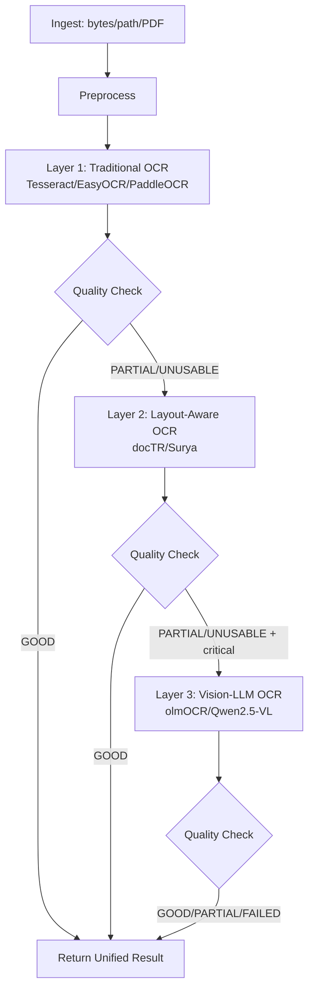

# Open-Source OCR Stack Architecture for Fintech Documents

## High-Level Architecture

This architecture applies a **three-layer OCR decision strategy** using only open-source tooling, designed for bank statements, loan/KYC forms, receipts/invoices, contracts/disclosures, and noisy/handwritten inputs.

## Core Interfaces & Data Structures

Implemented in [ocr_service/modules/open_source_ocr_stack.py](../modules/open_source_ocr_stack.py):

- `DocumentInput`
  - `id`, `bytes_or_path`, `mime_type`, `document_type`, `language`, `source`, `metadata`
- `DocumentResult`
  - `id`, `document_type`, `engine_used`, `raw_text`, `structured_output`, `quality_score`, `status`, `errors`, `fallback_chain`, `debug_info`
- Router entrypoints
  - `process_document(input: DocumentInput) -> DocumentResult`
  - `process_batch(inputs: list[DocumentInput]) -> list[DocumentResult]`

## Layer Implementation Strategy

### Layer 1 – Fast Traditional OCR

- Primary path uses existing iterative OCR with deterministic extraction.
- Best for clean scans and standard forms.
- Produces text + initial structure + quality score.

### Layer 2 – Layout-Aware OCR

- Activated when quality is insufficient and structure is required.
- Uses reconstruction/layout-aware path and preserves document blocks and hierarchy when available.
- Improves extraction for multi-column, table-heavy, or form-like pages.

### Layer 3 – Vision-LLM Rescue

- Activated only when Layer 2 remains insufficient for critical/complex documents.
- Uses advanced multimodal OCR with strict extraction instructions to reduce hallucinations.
- Intended for degraded scans and high-complexity layouts.

## Quality Scoring & Decision Logic

The evaluator returns:

- `quality_score` in `[0, 1]`
- `classification`: `GOOD | PARTIAL | UNUSABLE`
- machine-readable reasons

Heuristics include:

- minimum text length
- printable/alphanumeric ratio
- document-specific patterns:
  - Bank statement: account pattern + currency + multiple transaction-like rows
  - Loan/KYC: name/date/address/id-like patterns
  - Receipt/Invoice: merchant/date/total patterns

Routing policy:

- `GOOD` at Layer 1: accept
- `PARTIAL` for high-value docs: escalate to Layer 2
- `UNUSABLE` after Layer 2 and critical doc: escalate to Layer 3

## Normalized Fintech Output

Normalized schema generation includes baseline extractors for:

- Bank statements
- Loan/KYC applications
- Receipts/Invoices

Each extractor maps unstructured OCR text into stable, downstream-ready JSON objects with predictable keys (e.g., `transactions`, `total_amount`, `applicant`).

## Security & Logging

- Never log raw OCR text or document payloads.
- Log only metadata:
  - document id/type
  - engine used
  - timing and quality score
  - status and error codes
- Keep audit trace via `engine_used` + `fallback_chain`.

## Strategic Positioning vs Managed OCR Platforms

This stack is designed to maximize control and transparency while approaching managed-platform behavior through layered routing and quality gating.

Trade-offs:

- Pros: full control, no vendor lock-in, data residency control, lower software subscription cost
- Cons: higher MLOps/infra complexity (especially Layer 3 GPU operations), ongoing tuning burden

Recommended adoption:

- Start with this stack for PoCs and early production
- Introduce tighter SLAs, model governance, and active learning loops as volume and compliance pressure grow
