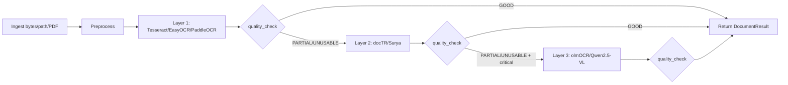

# Open-Source OCR Stack Playbook for Fintech Documents

## High-Level Architecture

This stack is **open-source only** and optimized for fintech workloads where traceability, predictable behavior, and operational control are mandatory. It uses a three-layer strategy that escalates only when quality is insufficient.



### Tooling Scope (Open Source Only)

- **Traditional OCR**: Tesseract, EasyOCR, PaddleOCR
- **Layout-aware OCR**: docTR, Surya
- **Vision-LLM OCR**: `allenai/olmOCR-7B-0725`, `Qwen/Qwen2.5-VL-7B-Instruct`
- **Core runtime**: Python, OpenCV, Pillow, pytesseract, transformers, optional CUDA
- **Explicitly excluded**: Unstract/LLMWhisperer or closed OCR SaaS APIs

## Core Interfaces & Data Structures

```python
from typing import Any, Literal
from pydantic import BaseModel, Field

Status = Literal["OK", "PARTIAL", "FAILED"]

class DocumentInput(BaseModel):
    id: str
    bytes_or_path: bytes | str
    mime_type: str | None = None
    document_type: str = "other"  # statement, loan_application, receipt, contract, other
    language: str = "eng"
    source: str | None = None
    metadata: dict[str, Any] = Field(default_factory=dict)

class DocumentResult(BaseModel):
    id: str
    document_type: str
    engine_used: str
    raw_text: str
    structured_output: dict[str, Any] = Field(default_factory=dict)
    quality_score: float = 0.0
    status: Status = "FAILED"
    errors: list[str] = Field(default_factory=list)
    debug_info: dict[str, Any] = Field(default_factory=dict)
    fallback_chain: list[str] = Field(default_factory=list)
```

### Orchestrator Signatures

```python
async def process_document(input_doc: DocumentInput) -> DocumentResult: ...

async def process_batch(inputs: list[DocumentInput]) -> list[DocumentResult]: ...
```

- `process_document`: routes one document across layers with quality gating.
- `process_batch`: executes concurrently (bounded by worker pool) and returns a stable list of `DocumentResult`.

## Implementation Sketches

## 4.1 Preprocessing Pipeline (Layer-Agnostic)

```python
import cv2
import numpy as np


def preprocess_image(img: np.ndarray) -> np.ndarray:
    if img is None:
        raise ValueError("Invalid image")

    gray = cv2.cvtColor(img, cv2.COLOR_BGR2GRAY) if len(img.shape) == 3 else img

    target_width = 1800
    h, w = gray.shape[:2]
    if 0 < w < target_width:
        scale = target_width / float(w)
        gray = cv2.resize(gray, None, fx=scale, fy=scale, interpolation=cv2.INTER_CUBIC)

    denoised = cv2.bilateralFilter(gray, 7, 40, 40)
    _, otsu = cv2.threshold(denoised, 0, 255, cv2.THRESH_BINARY + cv2.THRESH_OTSU)
    adaptive = cv2.adaptiveThreshold(
        denoised, 255, cv2.ADAPTIVE_THRESH_GAUSSIAN_C, cv2.THRESH_BINARY, 35, 15
    )
    merged = cv2.bitwise_and(otsu, adaptive)
    return deskew(merged)


def deskew(bin_img: np.ndarray) -> np.ndarray:
    points = np.column_stack(np.nonzero(bin_img < 255))
    if len(points) < 50:
        return bin_img
    angle = cv2.minAreaRect(points)[-1]
    if angle < -45:
        angle = 90 + angle
    angle = -angle
    if abs(angle) < 0.3:
        return bin_img

    h, w = bin_img.shape[:2]
    m = cv2.getRotationMatrix2D((w // 2, h // 2), angle, 1.0)
    return cv2.warpAffine(bin_img, m, (w, h), flags=cv2.INTER_CUBIC, borderMode=cv2.BORDER_REPLICATE)
```

### PDF to Images (open-source)

```python
import pypdfium2 as pdfium


def pdf_to_images(pdf_path: str, scale: float = 2.0):
    pdf = pdfium.PdfDocument(pdf_path)
    images = []
    for i in range(len(pdf)):
        pil_img = pdf[i].render(scale=scale).to_pil()
        images.append(pil_img)
    pdf.close()
    return images
```

## 4.2 Layer 1 (Tesseract / EasyOCR / PaddleOCR)

### Tesseract Path

```python
import pytesseract
from PIL import Image


def run_tesseract_ocr(pil_img: Image.Image, lang: str = "eng+spa", psm: int = 6, oem: int = 3) -> dict:
    config = f"--oem {oem} --psm {psm} -l {lang}"
    text = pytesseract.image_to_string(pil_img, config=config)
    compact = text.strip()
    whitespace_ratio = (sum(ch.isspace() for ch in text) / max(len(text), 1))
    return {
        "text": compact,
        "char_count": len(compact),
        "whitespace_ratio": round(whitespace_ratio, 4),
        "engine": "tesseract",
    }
```

### EasyOCR / PaddleOCR Option

```python
# EasyOCR
# import easyocr
# reader = easyocr.Reader(["en", "es"], gpu=True)
# result = reader.readtext(np_img, detail=0, paragraph=True)

# PaddleOCR
# from paddleocr import PaddleOCR
# ocr = PaddleOCR(use_angle_cls=True, lang="en")
# result = ocr.ocr(np_img, cls=True)
```

## 4.3 Layer 2 (docTR / Surya)

### docTR Example

```python
from doctr.io import DocumentFile
from doctr.models import ocr_predictor


def run_doctr(pdf_path: str) -> dict:
    model = ocr_predictor(pretrained=True)
    doc = DocumentFile.from_pdf(pdf_path)
    result = model(doc).export()

    pages = []
    for p_idx, page in enumerate(result.get("pages", []), start=1):
        blocks = []
        for block in page.get("blocks", []):
            block_text = " ".join(
                word.get("value", "")
                for line in block.get("lines", [])
                for word in line.get("words", [])
            ).strip()
            blocks.append({
                "type": "text",
                "text": block_text,
                "bbox": block.get("geometry"),
            })
        pages.append({"number": p_idx, "blocks": blocks})
    return {"pages": pages, "engine": "doctr"}
```

### Surya Example (conceptual integration)

```python
# from surya.foundation import FoundationPredictor
# from surya.recognition import RecognitionPredictor
# from surya.detection import DetectionPredictor
# predictors = ...
# predictions = recognition_predictor([image], det_predictor=detection_predictor)
# map predictions -> pages/blocks/lines/words schema
```

Why Layer 2 helps:
- preserves coordinates and reading order,
- improves table parsing and section reconstruction,
- supports form- and layout-driven extraction logic.

## 4.4 Layer 3 (olmOCR / Qwen2.5-VL via transformers)

```python
import base64
import torch
from transformers import AutoModelForImageTextToText, AutoProcessor


STRICT_OCR_PROMPT = (
    "You are an OCR engine. Return only the plain text and markdown tables "
    "that appear in this document. Do not hallucinate or invent content. "
    "If something is unreadable, write [UNREADABLE]."
)


def run_vlm_ocr(image_bytes: bytes, model_id: str = "Qwen/Qwen2.5-VL-7B-Instruct") -> str:
    processor = AutoProcessor.from_pretrained(model_id)
    model = AutoModelForImageTextToText.from_pretrained(
        model_id,
        torch_dtype=torch.float16,
    ).to("cuda" if torch.cuda.is_available() else "cpu").eval()

    b64 = base64.b64encode(image_bytes).decode("utf-8")
    messages = [{
        "role": "user",
        "content": [
            {"type": "image", "image": b64},
            {"type": "text", "text": STRICT_OCR_PROMPT},
        ],
    }]

    inputs = processor.apply_chat_template(
        messages,
        add_generation_prompt=True,
        tokenize=True,
        return_dict=True,
        return_tensors="pt",
    ).to(model.device)

    output_ids = model.generate(
        **inputs,
        max_new_tokens=1200,
        do_sample=False,
        temperature=0.0,
    )
    generated_ids = [
        out[len(inp):] for inp, out in zip(inputs.input_ids, output_ids)
    ]
    return processor.batch_decode(generated_ids, skip_special_tokens=True)[0]
```

Notes:
- `do_sample=False` and `temperature=0.0` reduce nondeterminism.
- still treat Layer 3 as rescue path due to GPU and latency costs.

## Routing and Quality Scoring

```python
async def process_document(input_doc: DocumentInput) -> DocumentResult:
    # 1) Layer 1
    # 2) score quality
    # 3) escalate to Layer 2 if needed
    # 4) escalate to Layer 3 only for critical+insufficient docs
    ...
```

Quality evaluator heuristics:
- global: text length, alnum ratio, printable ratio
- bank statements: account signal + currency + multiple txn-like rows
- loan/KYC: name + date + address + id-like signals
- receipt/invoice: merchant + date + total pattern

Classification:
- `GOOD`: accept layer output
- `PARTIAL`: escalate if document is high-value
- `UNUSABLE`: escalate to next layer or mark for manual review

## Normalization for Fintech Use Cases

### Canonical Schemas

```json
{
  "bank_statement": {
    "account_holder": "...",
    "account_number": "...",
    "statement_period": "...",
    "currency": "USD",
    "transactions": [
      {"date": "...", "description": "...", "amount": "...", "balance": "..."}
    ]
  }
}
```

```json
{
  "loan_application": {
    "applicant": {"name": "...", "dob": "...", "address": "...", "id_number": "...", "contact": "..."},
    "employment": {"employer": "...", "income": "..."},
    "loan_details": {"amount": "...", "term": "...", "product": "..."}
  }
}
```

```json
{
  "receipt_invoice": {
    "merchant": "...",
    "date": "...",
    "items": [
      {"description": "...", "qty": "...", "unit_price": "...", "line_total": "..."}
    ],
    "total_amount": "...",
    "taxes": "..."
  }
}
```

### Mapping Approach by Layer

- **Layer 1**: regex + line grouping over raw text.
- **Layer 2**: use bbox/read-order for section anchoring and table reconstruction.
- **Layer 3**: parse markdown/JSON output with strict schema validators and fallback sanitizers.

## Security & Logging

Never log raw OCR content or full extracted PII.

Log only:
- `document_id`
- `document_type`
- `engine_used`
- step latencies (`preprocess_ms`, `ocr_ms`, `postprocess_ms`)
- `quality_score`
- `status`
- machine-readable error codes (`OCR_ENGINE_TIMEOUT`, `EMPTY_RESULT`, `MODEL_ERROR`)

PII handling:
- mask identifiers in logs (e.g., `****1234`),
- separate raw document storage from app logs,
- include model/engine/version in audit metadata for traceability.

## Strategic Comparison & Roadmap

### Open Source Stack vs Managed OCR Platforms

- **Accuracy on hard docs**: managed platforms often stronger out-of-the-box; open-source can approach with layered routing + tuning.
- **Layout preservation**: Layer 2/3 narrows the gap significantly.
- **Operations**: open-source requires stronger internal MLOps and observability.
- **Compliance/control**: open-source wins on transparency, residency control, and lock-in avoidance.
- **Cost**: open-source reduces subscription cost but increases engineering + infra burden.

### When to choose what

- Start open-source for PoC/early scale when control and customization are key.
- Consider managed if you need strict SLAs at very high volume and lack internal OCR/ML platform capacity.

### Evolution roadmap

1. Add document-specific benchmarks and golden datasets.
2. Add active learning loops for difficult document classes.
3. Add model registry/version pinning and canary rollout.
4. Add hybrid confidence fusion (Layer1 + Layer2 vote).
5. Add robust schema-level validation and feedback-to-training.
